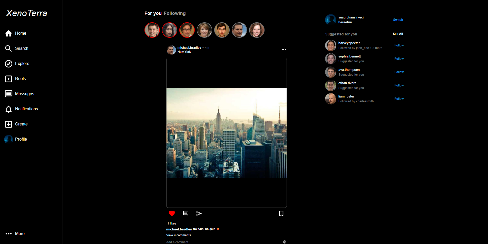
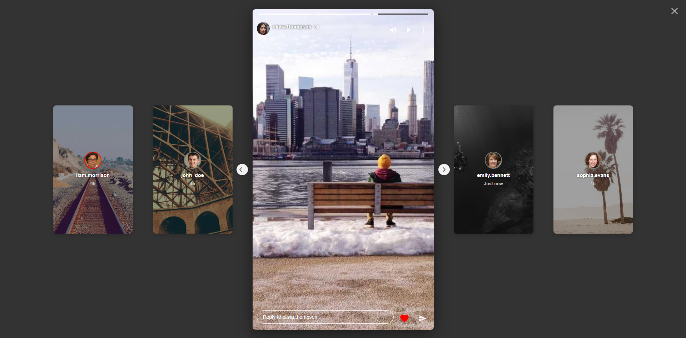
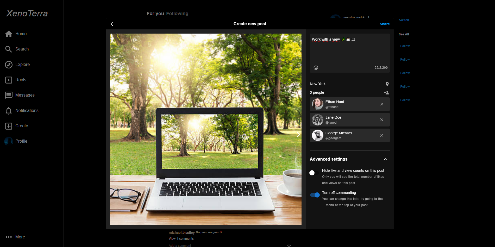
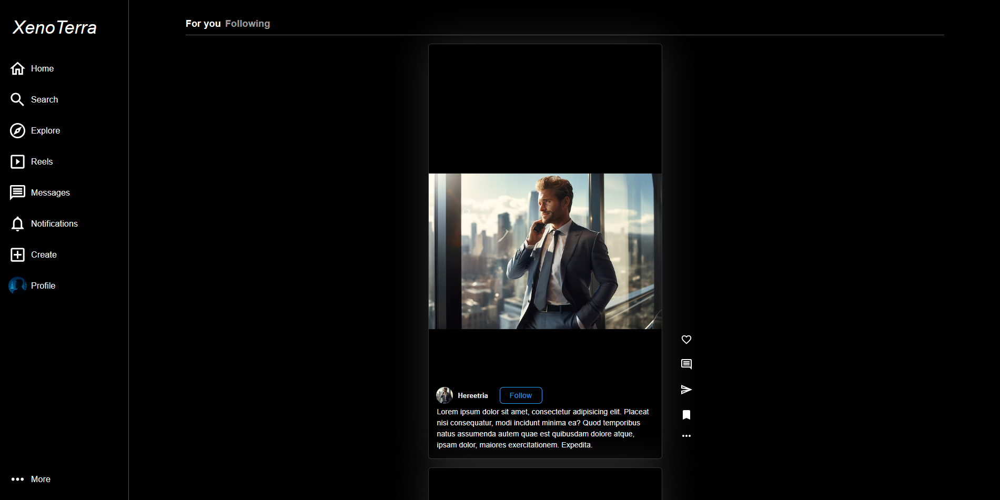
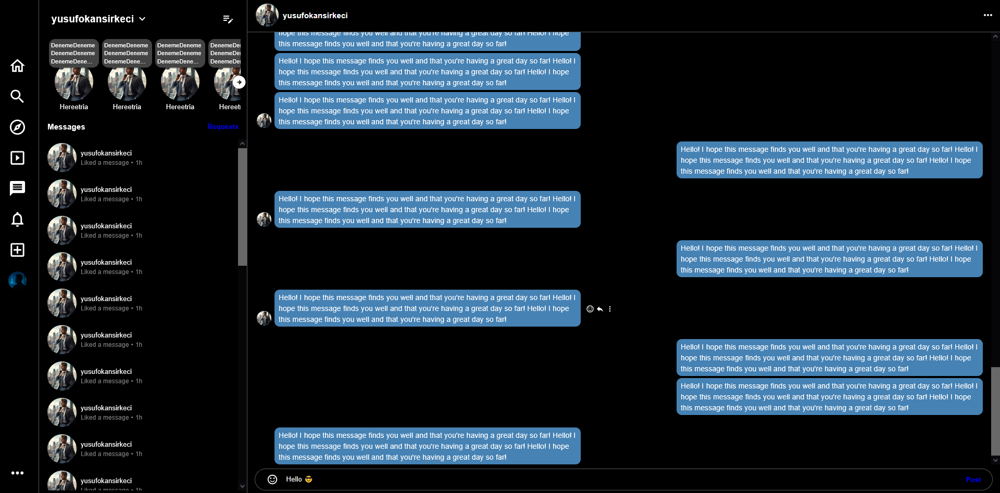
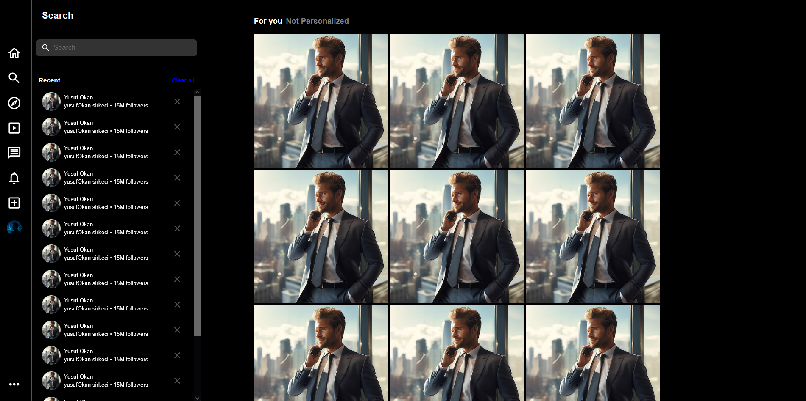
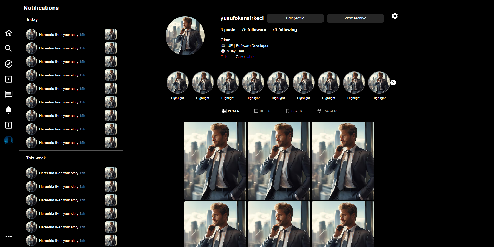

# 📱 Instagram Clone UI - Modern Responsive Frontend Showcase

 

 

## 📌 Project Overview

This repository presents the **frontend design** of an Instagram clone project.  
It focuses on UI structure, layout, and responsive behavior.  
The backend is provided by the [XenoTerra API](https://github.com/Hereetria/XenoTerra_API), which is an **open-source project** hosted separately.

> ℹ️ This repository is for **design presentation only**, not for distributing frontend code.

 

## ✨ Features

This project recreates core **Instagram-like functionalities** through a responsive front-end design.  
All layouts are built to adapt seamlessly across mobile, tablet, and desktop.

- 🧭 **Content Discovery** — Explore feed and search panel for finding other users' posts  
- 🏠 **Feed & Interactions** — Like, comment, and save posts on the main feed  
- 📖 **Stories Experience** — Full-screen stories with horizontal navigation and progress indicators  
- ➕ **Post Creation** — Modal flow for creating posts with captions, tags, and advanced settings  
- 👤 **User Profiles** — View profile info, posts, saved and tagged content  
- 🔔 **Notifications Panel** — Sidebar notifications integrated into the profile section  
- 🎬 **Reels Experience** — Vertical reels feed with smooth scrolling interaction  
- 💬 **Messaging Interface** — Direct messaging layout with chat and conversation sidebar
- 📱 **Responsive UI** — Fluid layout that scales across different screen sizes

 

## 🖼️ Screenshots

> ℹ️ A quick visual overview of the project’s main pages and features.

  
  
  

  
  
  

  
  
  

 

## 🧰 Tech Stack

This project was built using the following technologies:

  
  
  
  

 

## 📝 License

This project is licensed under the terms described in the [LICENSE](./LICENSE) file.

 

## ⚠️ Disclaimer

This project is **not affiliated with or endorsed by Meta or Instagram**.  
